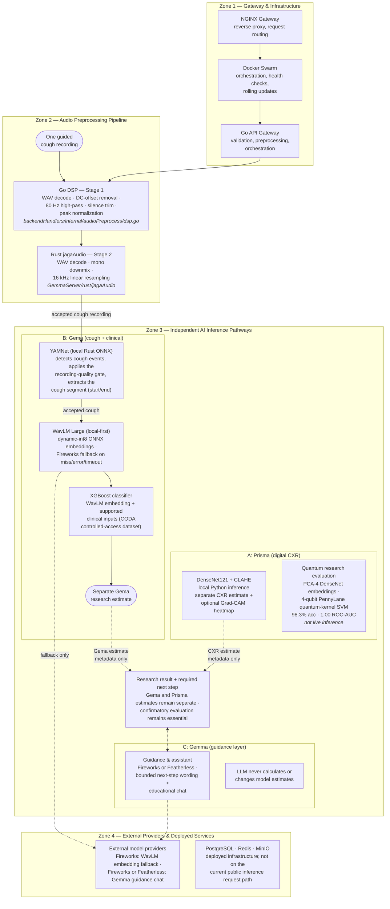

# Jaga · Project Architecture

**Document type:** Project architecture
**Audience:** Backend, frontend, ML, platform, QA, and technical reviewers
**Status:** Active · core pipeline built and integrated; remaining owner blocks are genuine gaps, not the whole system
**Updated:** 2026-07-13
**Canonical for:** System boundaries, planned runtime components, shared interfaces, privacy, security, observability, deployment, and technical ownership
**Companion documents:** [`product-requirements.md`](product-requirements.md), [`data-evaluation-plan.md`](data-evaluation-plan.md), [`design-guidelines.md`](design-guidelines.md), [`implementation-plan.md`](implementation-plan.md), [`evidence-register.md`](evidence-register.md)

## How to read this document

The PRD defines behavior and safety. Sections 1–13 remain the target contract; sections 14–16 record what actually exists in the repository today and where it still diverges from that contract. Where an owner-input block below has been overtaken by shipped code, it is annotated **(overtaken by §14–§16)** rather than deleted, so the gap between the intended contract and the as-built system stays visible. Do not treat "code exists" as "the contract is signed" — read §16 before relying on any of this for a performance or security claim.

## 1. Architectural principles

1. **Research boundary first.** Architecture must preserve the symptomatic-adult cohort, mandatory confirmatory-evaluation rule, and research-only framing.
2. **One complete loop.** Optimize capture → quality → inference → result → reset before adding stretch work.
3. **AMD is load-bearing.** The selected model is trained/evaluated and served through a pinned ROCm/MI300X workflow.
4. **Transient inputs.** No patient-input database, object-storage archive, request-body logs, or analytics payloads.
5. **Versioned contracts.** Frontend, backend, model artifact, preprocessing, calibration, and copy bundle expose compatible versions.
6. **Fail closed.** Missing model metadata, failed quality checks, schema mismatches, timeouts, or unavailable inference return no estimate.
7. **Evidence is visible.** Published CODA benchmarks and actual Jaga results are never conflated.

## 2. System boundary [MVP]

```text
Phone/PWA
  ├─ eligibility + consent
  ├─ supported clinical form
  ├─ five guided cough attempts
  └─ transient in-memory state
          │ HTTPS multipart request
          ▼
Go API + Prisma worker on AMD infrastructure
  ├─ schema/version validation
  ├─ request-scoped preprocessing
  ├─ audio-quality gate
  ├─ model + calibration artifact
  ├─ result/limitations composer
  └─ metadata-only observability
          │ structured response
          ▼
PWA result
  ├─ calibrated research estimate
  ├─ relative urgency band
  ├─ mandatory confirmatory evaluation
  ├─ non-causal inspection artifacts
  └─ reset clears all local state
```

The MVP has no user account, patient database, case history, queue, background job, EHR integration, or analytics warehouse.

### 2.1 Backend request flow (detailed)

Four zones; two independent AI pathways (Gema, Prisma) whose estimates are **never fused**. Solid arrows are the live internal request flow; dashed arrows are external API calls or evaluation metadata.



Diagram notes:

- **Privacy:** demo inputs are processed transiently and are not retained.
- **Efficiency:** the YAMNet gate passes only the detected cough segment to WavLM, and WavLM runs local-first as an int8 ONNX model in Rust; the Fireworks embedding API is a fallback used only when the local model is missing, errors, or times out (§15.5). Fireworks/Featherless also serves the Gemma guidance chat.
- **Safety:** the LLM writes guidance copy around the model output; probabilities always come from the classical models. Every LLM failure path falls back to deterministic bilingual copy.
- **Training:** both models were trained on AMD Instinct MI300X (AMD Developer Cloud, ROCm PyTorch) — see §14.3 and the README's "AMD & approved compute usage" section.

## 3. Frontend architecture [MVP]

### 3.1 Locked constraints

- Next.js PWA with a single-session, step-based capture flow.
- Patient inputs remain in memory; no localStorage, IndexedDB, service-worker cache, or analytics event may contain them.
- The UI consumes only the signed API schema and deterministic bilingual string bundle.
- Browser audio is converted only according to the signed upload contract.
- Every loading, error, retry, offline, reset, language, and reduced-motion state in PRD-01 through PRD-08 must be represented.

### 3.2 Signed frontend architecture (Billy, 2026-06-28)

- **Libraries:** Next.js (App Router) PWA + React; **Tailwind CSS 4** through `@tailwindcss/postcss`, retaining `tailwind.config.ts` through the `@config` bridge; **shadcn/ui** Radix/Nova preset `b85jYWWKi8` for the five routed surfaces and shared layout. Shadcn semantic variables map to the signed §4 Jaga tokens rather than replacing them. The theme is light-only with no `ThemeProvider`; dark selectors remain class-gated and inactive. No global state library — the step machine is local React state / `useReducer`, all in memory. *(As-built correction, 2026-07-13: the shipped frontend does use a small global store — Zustand, `frontend/src/store/session.store.ts` `useSessionStore` — for session state; see the in-memory model bullet below. The in-memory guarantee is unchanged.)* Audio uses the **Web Audio API + `<canvas>`** for the recorder/waveform (no audio dependency). Motion is CSS-first (transform/opacity); add a small motion library only if a specific transition needs it.
- **Route / screen map and state machine:** defined once in [`design-guidelines.md`](design-guidelines.md) §3 (gate → clinical → coughs → review → processing → result → limitations, with reset/error). Not duplicated here.
- **API state/error mapping:** `design-guidelines.md` §3.3; exact codes pin on Daffa's `ARCH-1` contract (§6).
- **In-memory form/audio model:** clinical values + five decoded cough buffers + result + request-id held in React state only; cleared on reset, success acknowledgement, or session timeout (PRD-08). No `localStorage`/`IndexedDB`/service-worker cache/analytics may contain them. *(As-built, 2026-07-13: this state lives in the memory-only Zustand `useSessionStore` — clinical values, the single cough recording `File`, result, and request-id; no `persist` middleware, cleared on `reset()`. Grep confirms no localStorage/IndexedDB/sessionStorage/service-worker persistence of patient data, so the privacy guarantee in this bullet still holds.)*
- **Accessibility & responsive:** `design-guidelines.md` §5–§9 (320 px floor, AA contrast evidence, reduced-motion, text alternatives).
- **Planned folder structure** (under the `frontend/` of §11):

```text
frontend/
├── components.json     # shadcn/ui Radix/Nova configuration and aliases
├── app/                # routes: / (gate), /clinical, /coughs, /review, /result
├── components/         # reusable + screen-specific (re-skinned from ClinicalCaptureForm.jsx)
├── lib/                # step state machine, in-memory session model, audio capture/quality
├── locales/            # keyed/versioned EN + ID string bundles (UX-1)
└── styles/             # token CSS variables + Tailwind config
```

> `POST /api/v1/triage` is implemented and consumed by the frontend (§15); the remaining open dependency is the quality-gate reason-code enum and exact HTTP status mapping (§4/§6), plus the paired EN/ID string table (`UX-1`).

### 3.3 Frontend implementation boundary

Billy owns frontend architecture, UX, accessibility, and review. Kei implements the signed specification. Kei may propose changes, but any change to behavior, safety, state, or contract must be accepted in the canonical document before implementation.

## 4. Backend architecture [MVP]

### 4.1 Locked constraints

- Go REST API (public orchestrator) plus a Python (Prisma) serving worker, packaged in Docker and deployed on AMD infrastructure via Docker Swarm.
- Request-scoped processing only; no input persistence.
- Validate content type, byte limits, encoding, field schema, contract version, and model availability before inference.
- Return structured error codes; never return partial or stale estimates.
- Model loading, preprocessing, inference, calibration, inspection, and result composition are separate modules with versioned boundaries.
- The two research signals are co-equal `[MVP]` named modules: **Gema** (cough-plus-clinical core) and **Prisma** (digital-CXR). They are trained, served, evaluated, and displayed separately, built in parallel, and are never fused into one score.
- Health endpoints disclose service/model readiness without exposing secrets or participant information.

> **(overtaken by §14–§16) OWNER INPUT REQUIRED — Daffa — originally due 2026-06-29**
>
> **Blocks:** `ARCH-1`, `BE-0` through `BE-4`, and all frontend/backend integration
>
> **Status:** the backend runtime, module boundaries, and API schemas were built rather than formally signed off first — see §16.1 for the resulting divergence. **Still genuinely open:** request size/timeout/concurrency limits, warm-up behavior, and version negotiation are not documented anywhere in code; the multipart upload cap is a single `32 << 20` (32 MiB) constant in `triage/handler.go` with no equivalent documented for `/api/v1/cxr` or `/api/v1/audio/preprocess`. Re-verified 2026-07-13, with two newly documented facts: the assistant endpoint caps JSON bodies at 64 KiB (`http.MaxBytesReader`), and `cmd/server/main.go` sets server timeouts (ReadHeader 10 s, Read 30 s, Write 30 s, Idle 60 s) — these partially answer the size/timeout ask, but per-endpoint limits remain undocumented for `/api/v1/cxr` and `/api/v1/audio/preprocess`, and no handler validates incoming `contract_version`/`schema_version` (they remain response-only constants `triage-v1`/`clinical-v1`).
>
> **Required output (remaining):** document request size/timeout/concurrency limits per endpoint; define model loading/warm-up behavior for the two Rust services; define version-negotiation behavior (there is currently none — `contract_version`/`schema_version` fields exist in the frontend proposal but the Go handlers do not check them)
>
> **Affected documents:** `project-architecture.md`, `data-evaluation-plan.md`, `implementation-plan.md`, `evidence-register.md` where a factual dependency changes
>
> **Completion rule:** replace this block with the signed limits/versioning behavior and verify the Go handlers enforce it

### 4.2 Backend implementation boundary

Daffa owns the architecture and accepts technical contract changes. Zeddin implements API routes, orchestration, containerization, deployment, and operational checks. Backend implementation may not change model semantics, safety copy, or schema fields without owner approval.

## 5. AI and inference pipeline [MVP]

The logical pipeline is fixed even though Daffa must select its implementations:

1. Validate schema and model/contract versions.
2. Decode the five guided cough attempts.
3. Apply deterministic preprocessing identical to evaluation.
4. Run the audio-quality gate and return per-attempt reason codes.
5. Aggregate accepted cough representations at participant level.
6. Combine only signed clinical features.
7. Produce an uncalibrated score from the selected evidence-gated model.
8. Apply a versioned calibration artifact fitted without test leakage.
9. Map the calibrated estimate to relative bands/urgency using versioned thresholds.
10. Produce optional non-causal inspection artifacts.
11. Return model, preprocessing, calibration, threshold, schema, and limitation versions.
12. Delete request-scoped input buffers.

> **(partly overtaken by §14–§16) OWNER INPUT REQUIRED — Daffa — originally due 2026-06-29**
>
> **Blocks:** `ML-1` through `ML-4`, `BE-2`, `BE-3`, and the result contract
>
> **Status:** the pipeline is implemented (§15.2, §15.5) — YAMNet cough gate, WavLM embedding + 12 demographic features, XGBoost TB probability — but the model-selection evidence gate itself was not run: there is no participant-grouped split, no leave-one-country-out evaluation, and no documented promotion decision against a baseline. See `data-evaluation-plan.md` §5 and §10 for the exact gap.
>
> **Required output (remaining):** run the signed evidence gate against the shipped XGBoost model (or document why it is exempt for the hackathon submission); define calibration and versioned band thresholds (currently a hardcoded 0.33/0.66 split in `xgboostService`, not a fitted calibration artifact — see §16.2); define latency/memory budgets; define inspection method/limitations for Gema (Prisma already has Grad-CAM/retrieval per §5.3 of the data plan)
>
> **Affected documents:** `project-architecture.md`, `data-evaluation-plan.md`, `evidence-register.md`, `implementation-plan.md`
>
> **Completion rule:** replace this block with the signed pipeline evaluation and link the reproducibility manifest, or explicitly accept the uncalibrated fixed-threshold behavior as the submitted state

## 6. Shared interface contract [MVP]

The contract version is carried in every request and response. The Gema inference operation is fixed as `POST /api/v1/triage`; the Prisma (digital-CXR) operation is a **separate** endpoint (`POST /api/v1/cxr`) that returns its own estimate and never merges with the cough result. `contracts/openapi/jaga-v1.yaml` is the machine-readable frontend integration proposal, including `GET /api/v1/status`, patient intake, the two inference operations, scoped assistant messages, and structured errors. The frontend can switch between explicitly synthetic fixtures and these live paths without component changes. Daffa must review and sign the complete backend contract before live deployment.

> **Resolved contradiction (§16.1, resolved 2026-07-13):** `contracts/openapi/jaga-v1.yaml` previously specified `coughs: minItems 5, maxItems 5` for `POST /api/v1/triage`; it now requires a single binary `cough` field, matching the shipped Go handler (`triage/handler.go`), the shipped frontend, and the single-recording capture protocol (PRD-03, design-guidelines §3.1). One minor staleness remains: the OpenAPI still declares the cough content type as `audio/webm` while the shipped frontend uploads `audio/wav` — see §16.1.

| Operation | Required responsibility |
|---|---|
| Service health | Process availability without claiming model readiness |
| Service readiness | Model, calibration, preprocessing, and schema compatibility |
| `POST /api/v1/triage` | Gema: five cough attempts plus signed clinical payload in one versioned request; performs validation, quality gating, inference, and result composition |
| `POST /api/v1/cxr` | Prisma: one digital-CXR image in a versioned request; performs validation, inference, and a separate result composition; never fused with `POST /api/v1/triage` |
| Result | Request ID, quality result, estimate/band/urgency, mandatory referral, model metadata, limitations, and inspection metadata (per signal, kept separate) |

> **(largely overtaken by §14–§16) OWNER INPUT REQUIRED — Daffa — originally due 2026-06-29**
>
> **Blocks:** `BE-1`, `BE-2`, `FE-2`, `FE-3`, `FE-4`, and `FE-5`
>
> **Status:** `POST /api/v1/triage` is implemented and consumed end to end by the frontend. **Still genuinely open:** the quality-gate reason-code enum in PRD-04 (too quiet / clipped / background noise / no cough / unsupported encoding) is not reflected in the Rust `yamnet` service's response shape — it returns a pass/fail cough-gate signal, not a structured reason code, so `retryable` UI guidance (design-guidelines §3.3) cannot yet map to the PRD's required guidance categories; and the exact HTTP status-code mapping for each failure path is not documented anywhere.
>
> **Required output (remaining):** define the quality-gate reason-code enum and wire it from `yamnetService` through `triage/handler.go` to the `gema` result; define the HTTP status mapping for validation, quality-rejection, and system-error responses. *(The 5-file vs. 1-file `coughs` reconciliation in `contracts/openapi/jaga-v1.yaml` was completed — §16.1, resolved 2026-07-13.)*
>
> **Affected documents:** `project-architecture.md`, `product-requirements.md`, `implementation-plan.md`, frontend API mapping in `design-guidelines.md`
>
> **Completion rule:** replace this block once the reason-code enum and status mapping are implemented and the OpenAPI contract matches the shipped handler

No field named `known_tb_contact` may be introduced unless Daffa documents its training/evaluation basis and the PRD is deliberately revised.

## 7. Data and storage boundaries

| Data | MVP location | Retention |
|---|---|---|
| Eligibility, clinical values, audio, result | Browser memory and request-scoped backend memory | Cleared on reset, acknowledgement, timeout, or request completion |
| Model/calibration/preprocessing artifacts | Versioned deployment image or read-only artifact store | Release-managed, non-patient data |
| Operational metrics | Metrics backend | Aggregate metadata only; no payloads or derived health estimates |
| Synthetic demo fixtures | Repository | Permitted synthetic/consented non-patient content only |
| CODA controlled-access data | Approved research environment | Governed by Synapse terms; never copied into repo or production service |

## 8. Security and privacy [MVP]

- TLS for all external traffic.
- Secrets supplied through deployment environment, never committed or returned.
- Strict CORS allowlist for the deployed frontend.
- MIME/content validation and bounded request sizes before decode.
- No request/response body logging, trace payloads, audio persistence, or estimate analytics.
- Redact query strings, exception context, and framework access logs where they could expose fields.
- Rate limiting and bounded concurrency prevent trivial resource exhaustion.
- Container runs as a non-root user with a minimal runtime image where platform support permits.
- Dependency versions and the ROCm base image are pinned.

> **OWNER INPUT REQUIRED — Daffa — originally due 2026-06-29**
>
> **Blocks:** `ARCH-2`, `BE-4`, and production deployment approval
>
> **Status:** partially implemented, not signed off. The Go gateway is no-auth (consistent with a public demo) and has a CORS origin allowlist read from `JAGA_ALLOWED_ORIGINS` (defaulting to permitting only `localhost`/`127.0.0.1` if unset — §16.1 flags this default as unsafe for a public deployment). No rate limiting, request-size limit beyond the 32 MiB multipart cap on `/api/v1/triage`, secret-redaction policy, session-timeout enforcement, or non-root container user has been verified in the repository.
>
> **Required output (remaining):** confirm `JAGA_ALLOWED_ORIGINS` is set to the real deployed frontend origin (not left on the localhost default) before the public demo goes live; define rate/concurrency limits; define secret names and redaction rules; verify non-root container users in the Dockerfiles; define the incident/reset procedure
>
> **Affected documents:** `project-architecture.md`, `implementation-plan.md`, deployment section of `README.md` after scaffolding
>
> **Completion rule:** replace this block with the signed security profile and verify it against the deployed container

## 9. Observability [MVP]

Allowed telemetry is metadata-only:

- request count by terminal status;
- validation and quality reason-code counts;
- latency distributions by pipeline stage;
- model/artifact version readiness;
- CPU/GPU memory and utilization;
- container restarts and dependency failures.

Prohibited telemetry includes audio, clinical values, raw/derived health estimates, full request IDs in public dashboards, and user-entered text.

> **OWNER INPUT REQUIRED — Daffa — originally due 2026-06-29**
>
> **Blocks:** `BE-4` and `QA-3`
>
> **Status:** still fully open. `backend/backendHandlers` has no metrics/telemetry instrumentation in the repository as of 2026-07-13; the `GET /health` endpoint reports process liveness only, with no readiness signal for the Rust/Prisma dependencies it calls. This is a genuine gap, not a documentation lag.
>
> **Required output:** define metric names/labels, safe request-correlation format, alert thresholds, retention, dashboard access, and the smoke-test evidence required before demo; at minimum, add a readiness check that reflects whether `yamnet`, `xgboost`, and the Prisma worker are reachable
>
> **Affected documents:** `project-architecture.md`, `implementation-plan.md`
>
> **Completion rule:** replace this block with the signed observability contract and verify that no prohibited payload appears in logs or metrics

## 10. Deployment [MVP]

- Frontend and backend are reachable through HTTPS at the public demo URL.
- Backend and model runtime are containerized and run on AMD infrastructure.
- A clean public checkout can build and run using README instructions.
- Deployment exposes health/readiness checks and pins the same model/preprocessing/calibration versions evaluated for the demo.
- A failed readiness check prevents traffic from reaching inference.
- Deployment rollback restores the last verified artifact set without retaining participant data.

Zeddin owns implementation and deployment after Daffa signs architecture/security contracts. Fransisco owns submission completeness, not runtime operations.

## 11. Repository structure (as-built, verified 2026-07-11)

This reflects the actual current layout, which renamed and reorganized further after the `backend-train` layout recorded lower in this file (§14 predates this rename; kept for history, not re-written). The public request orchestrator is the **Go API** (`backend/backendHandlers`, Go module still named `jaga/backend/go` — a cosmetic leftover, not a functional issue); Gema's acoustic model services are two **Rust** ONNX services under `backend/modelServerandTraining/GemmaServer/rust`; Gema's training artifacts live in `backend/modelServerandTraining/GemmaTraining`; Prisma serving is `backend/modelServerandTraining/PrismaServer`; Prisma training/research is `backend/modelServerandTraining/PrismaTraining`. (Supersedes both the originally planned `apps/api/` FastAPI layout and the intermediate `backend/go` + `backend/python/{PrismaServer,PrismaTraining}` layout described in §14; contract semantics in §4–§6 are unchanged except where §16 flags a divergence.)

```text
backend/
├── backendHandlers/         # public Go REST API + orchestration (request orchestrator)
│   ├── cmd/server/          # entrypoint
│   └── internal/            # assistant, audioPreprocess, cxr, demographics, ids, llm (+ prompts/), response, server, triage
└── modelServerandTraining/
    ├── GemmaServer/rust/    # Gema model services: jagaAudio, yamnetService, xgboostService (ONNX via `ort`)
    ├── GemmaTraining/       # Gema research: dataPrep/mergedata.py, notebooks/trainDetector.ipynb
    ├── PrismaServer/        # Prisma serving worker (FastAPI; bundled local_clahe artifacts + quantum metrics)
    └── PrismaTraining/      # Prisma research/training: configs, data, models, training, evaluation,
                             #   retrieval, quantum, scripts, utils (controlled-access data ignored)
infra/                       # Docker Swarm deployment plane
├── docker-stack.yml         # nginx, web (frontend), go-api, prisma-worker, yamnet, xgboost,
│                            #   redis, postgres, minio (cognee removed — §16.3; verified 2026-07-13)
├── nginx/ postgres/ redis/ minio/
├── healthcheck/             # api / prisma probes
└── scripts/                 # build, deploy, logs, scale, remove (sh + ps1)
                             # .env.example adds LLM_PROVIDER, FEATHERLESS_*, WAVLM_MODEL_PATH,
                             #   LOCAL_EMBED_TIMEOUT_SECS, and yamnet/xgboost image tags (2026-07-13);
                             #   the WavLM model is baked into the xgboost image — the model_cache
                             #   volume remains prisma-worker only
frontend/                    # PWA capture/result client (Next.js; see §3.2) — renamed from apps/web 2026-06-30
contracts/openapi/           # jaga-v1.yaml — frontend integration proposal (single-cough contract aligned 2026-07-13;
                             #   minor audio/webm content-type staleness — §16.1; two unshipped proposal endpoints — §16.4)
design/                      # design tooling: swatch.html (token preview) + contrast.mjs (WCAG ratio verifier, design §4); not application code
```

> **Removed 2026-07-13:** the leftover `apps/web/` stub (superseded by `frontend/` at the 2026-06-30 rename; nothing built from it) and the root `components/ClinicalCaptureForm.jsx` provisional prototype (never imported) were deleted to keep the tree unambiguous for reviewers. `design/` is retained as standalone accessibility tooling.

**Endpoints (as-built, verified against `backend/backendHandlers/internal/server/router.go` and `backend/modelServerandTraining/PrismaServer/app/main.py` on 2026-07-13 — unchanged since 2026-07-11):**

| Service | Method · Path | Status |
|---|---|---|
| Go gateway | `GET /health` | Live — process liveness only, no dependency readiness (§9) |
| Go gateway | `POST /api/v1/demographics` | Live — validation |
| Go gateway | `POST /api/v1/audio/preprocess` | Live — audio DSP (§15) |
| Go gateway (Gema orchestrator) | `POST /api/v1/triage` | Live — cough gate + acoustic TB model + Gemma next-step (§15); takes one `cough` file, matching the now-aligned OpenAPI contract (§16.1, resolved) |
| Go gateway (assistant) | `POST /api/v1/assistant/messages` | Live — Gemma guidance chat (§15) |
| Go gateway → Prisma | `POST /api/v1/cxr` | Live — proxied to Prisma worker (§15) |
| Prisma worker (direct, Python/FastAPI) | `GET /health`, `GET /api/v1/status`, `POST /api/v1/cxr`, `GET /api/v1/quantum` | Live — DenseNet121 CLAHE + quantum highlight (§15) |
| Go gateway | `POST /api/v1/patient/intake`, `GET /healthz`, `GET /api/v1/status`, `GET /v1/status`, `GET /internal/health/cognee` | **Not present** in `router.go` as of 2026-07-13 — earlier revisions of this document described these as live; they were either superseded by the endpoints above or never carried forward into `backendHandlers`. Do not rely on them without re-verifying. |

> Tests (`tests/contract/`, `tests/integration/`, `tests/privacy/` per the planned schema/integration/privacy split) are not scaffolded as of 2026-07-11; the frontend has its own `e2e/` Playwright suite and `src/test/` unit tests instead.

## 12. Failure policy [MVP]

| Failure | Required behavior |
|---|---|
| Invalid eligibility/schema | Block submission and preserve correct local entries |
| Audio-quality failure | No estimate; targeted retry for affected attempts |
| Model/calibration unavailable | Readiness fails; no estimate |
| Timeout/service unavailable | No estimate; retry option; no stale result |
| Contract mismatch | Terminal technical error; deploy versions must be reconciled |
| Inspection generation fails | Result may proceed only if estimate, safety copy, and metadata are valid; inspection is marked unavailable |

### 12.1 Independent-module failure isolation

| Failure | Required behavior |
|---|---|
| Prisma (CXR) fails `[MVP]` | Gema core result remains independent and unchanged; Prisma panel marked unavailable |
| Fireworks fails `[Stretch]` | Deterministic copy remains; no effect on estimate/referral |

## 13. Architecture acceptance

Architecture is ready for implementation only when:

- every Daffa and Billy owner-input block is replaced with a signed decision;
- PRD-01 through PRD-12 map to modules/interfaces and tickets;
- frontend/backend contract examples validate against one shared schema;
- no patient persistence or payload logging path exists;
- the pinned ROCm container loads the selected artifacts;
- quality, inference, result, and error states are versioned;
- Zeddin and Kei can implement without inventing fields, states, or thresholds.

---

## 14. Implemented backend runtime (`backend-train`, historical)

> **Status:** Historical snapshot of the `backend-train` branch's runtime layout (`backend/go`, `backend/python/PrismaServer`, `backend/python/PrismaTraining`). The repository has since been reorganized to `backend/backendHandlers` and `backend/modelServerandTraining/{GemmaServer,GemmaTraining,PrismaServer,PrismaTraining}` — see §11 for the current, verified layout and endpoint table, and §15–§16 for the current behavior. This section is kept as a record of what existed at that point in time rather than rewritten; do not use its paths for anything except history.

### 14.1 Runtime split

- `backend/python/PrismaTraining` — research and training tree (embedding-first; backbones, training/eval, embedding export, retrieval, post-training quantum branch).
- `backend/python/PrismaServer` — serving worker; `backend/python/PrismaServer/artifacts/local_clahe` holds the current default serving bundle for local and single-node runs.
- `backend/go` — API and orchestration layer (currently patient intake at `POST /api/v1/patient/intake` plus health/status; validates and normalizes metadata, no persistence or ML calls yet).
- `infra` — Docker Swarm deployment plane.

### 14.2 Architecture layers

1. **Capture** — phone mic for guided coughs plus a short structured form; optional digital chest X-ray (Prisma) is the parallel signal.
2. **Backend intake** — Go REST API validates/normalizes patient metadata before any Prisma cough or CXR payload; hosts health endpoints and optional semantic-memory integration; intake does not persist patient records.
3. **Preprocess** — cough → mel-spectrogram and compact audio features; structured inputs normalized.
4. **AI inference on AMD** — cough + clinical model (Gema) produces a calibrated TB-risk probability; the CXR track (Prisma) is a separate model path.
5. **Explain / compose** — spectrograms, attention overlays, calibrated probability, thresholded band, deterministic bilingual referral copy, and optional LLM explanation through Featherless.
6. **Semantic memory** — once structured evidence exists, Cognee may store semantic summaries only (prior predictions, retrieval/quantum/clinical summaries, recommendations, lightweight metadata). Optional; inference must continue if it is unavailable.
7. **Presentation** — Next.js/PWA capture flow and result dashboard.

### 14.3 Tech stack

Next.js / PWA · Go REST API · Prisma Python worker (`PrismaServer`) · TB-CXR research package (`PrismaTraining`) · PyTorch on ROCm (MI300X) · Featherless via an OpenAI-compatible API surface · Cognee semantic memory · PostgreSQL · Redis · MinIO · NGINX · Docker Swarm.

### 14.4 CXR research track (Prisma)

- Interchangeable backbones under `PrismaTraining`; saved embeddings support FAISS retrieval built from exported artifacts.
- A post-training quantum branch compares classical PCA + RBF SVM against PCA + Quantum Kernel SVM on saved embeddings only.
- The serving tree is intentionally separate from this research tree.

### 14.5 Deployment

Docker Swarm with NGINX reverse proxy, replicated `go-api` tasks, and an internal `prisma-worker` tier backed by Redis, PostgreSQL, and MinIO. The normal local run path is stack-first: build images, deploy the stack, operate through `infra/scripts/`.

### 14.6 Memory architecture

- PostgreSQL is the source of truth; Cognee is not mandatory and degrades gracefully.
- Cognee stores semantic summaries only — never raw images, audio, embeddings, FAISS indices, or checkpoints.
- Default deployment keeps Cognee local and uses Featherless instead of a second local LLM service.
- The Go backend depends on a neutral memory interface, not on Cognee APIs directly.

### 14.7 Open items

- Confirm the final cough + clinical backbone for the demo path.
- Reconcile the as-built `POST /api/v1/triage` / `POST /api/v1/cxr` contracts (§15) with Daffa's `ARCH-1` sign-off.
- Wire completed inference output into the memory layer without blocking predictions.
- Confirm the submission deployment environment and public URL.

---

## 15. Acoustic triage + model services (as-built)

YAMNet's detection response also includes `coughEvents` (`startSec`, `endSec`, `peakScore`) and `coughEventCount`, derived by grouping consecutive model windows at the existing gate threshold. Timing is approximate because the model windows overlap, and event ends are clamped to the decoded recording duration. After accepted YAMNet and XGBoost inference, the gateway trusts `len(coughEvents)`, exposes it as GemaResult `detected_coughs`, and renders the spectrogram with the strongest event highlighted when processed audio is available. Spectrogram failure does not discard the count.

> **Status:** Implemented and current as of 2026-07-13 (paths verified against `backend/backendHandlers` and `backend/modelServerandTraining`). Records the acoustic-triage pipeline, the Gemma
> orchestrator/assistant, the Rust model services, and the Prisma CXR + quantum
> path. Behavior reconciles to the signed §4–§6 contracts:
> signals stay separate, estimates come from calibrated models (never the LLM),
> and every path fails closed. "Calibrated" here means a fixed decision threshold, not
> a fitted calibration curve — see §16.2 and `data-evaluation-plan.md` §6.

### 15.1 Service topology

```text
Frontend ──► NGINX ──► Go API (gateway, backend/backendHandlers)
   POST /api/v1/demographics        validate → gema/prisma contracts
   POST /api/v1/audio/preprocess    DC-offset · 80 Hz high-pass · silence trim · peak-normalize (pure Go)
   POST /api/v1/triage      ─┐  Gema orchestrator
   POST /api/v1/assistant/messages  Gemma guidance chat
   POST /api/v1/cxr         ─┼─► Prisma worker (Python)
                             │
        ┌────────────────────┴───────────────────────┐
        ▼                                             ▼
  yamnet (Rust, :8081)                        xgboost (Rust, :8082)
  YAMNet ONNX cough gate                      demo preprocessor (in-Rust) + XGBoost ONNX
  class 42 "Cough", frame-sliding             local WavLM int8 ONNX → 1024
                                              (falls back to Fireworks — §15.5)
                                              + 12 demographic features → 1036 → TB prob
```

- **Runtime split:** Go API is the only public surface (gateway). The two Rust
  services and the Prisma worker are internal, reached over the overlay network.
- **ONNX Runtime:** both Rust services run models via the `ort` crate
  (ONNX Runtime), loaded dynamically through `ORT_DYLIB_PATH`. tract was rejected
  because the classical-ML ops (`TreeEnsembleClassifier`, `OneHotEncoder`,
  `Scaler`) it does not implement are exactly what these models use.

### 15.2 Gema orchestrator (Go + Gemma)

`POST /api/v1/triage` (`cough` WAV + `clinical` JSON) runs: audio preprocessing →
YAMNet cough gate → XGBoost TB probability → Gemma next-step. Gemma — served via
the configured LLM provider (`LLM_PROVIDER`: Fireworks default, Featherless
supported; see §15.3) — acts purely as an **orchestrator/summarizer**: it writes the
`mandatory_next_step` guidance and never invents or restates a probability — the
numeric estimate is the calibrated XGBoost output. No usable cough ⇒ `retryable`
with no estimate; any upstream failure ⇒ `system_error`; both fall back to
deterministic copy so the endpoint always returns a valid `gema` result. The
orchestrator omniprompt lives at `internal/llm/prompts/orchestrator.md`.

*(Audio format, as-built 2026-07-13: the frontend records WebM — MediaRecorder/Opus —
and converts it client-side to 16 kHz mono 16-bit PCM WAV
(`frontend/src/lib/audio-wav.ts`) before uploading it as the single `cough` file,
falling back to sending the raw WebM only if conversion throws. The Go gateway
decodes WAV via `audioPreprocess.DecodeWAV`; if decode fails it forwards the bytes
undecoded (`decoded=false`) and lets the model services surface the error.)*

### 15.3 Guidance assistant (Go + Gemma)

`POST /api/v1/assistant/messages` is the `assistant-v1` chat, also Gemma. The
assistant omniprompt (`internal/llm/prompts/assistant.md`) constrains it to
explaining the process and general TB facts; any request to diagnose, interpret
an individual result, or advise treatment returns a `safety_redirect`.

*(LLM provider, as-built 2026-07-13: `internal/llm/client.go` `ConfigFromEnv`
reads `LLM_PROVIDER` — default `"fireworks"`; `"featherless"` selects Featherless
(base `https://api.featherless.ai/v1`, env
`FEATHERLESS_URL`/`FEATHERLESS_CHAT_URL`/`FEATHERLESS_CHAT_MODEL`/`FEATHERLESS_API_KEY`).
Both providers serve Gemma; the Gemma chat template is applied locally and requests
hit the completions endpoint. This is a startup-time provider switch, not an
automatic runtime fallback. The assistant response echoes the active provider
(`assistant/handler.go`); one stale string remains — the 503 misconfiguration
message still names `FIREWORKS_API_KEY` even under Featherless. `parseReply` is
robust to preambles/code fences: it extracts the outermost `{...}` and falls back
to fence-stripped plain text as `answer`.)*

### 15.4 Prisma CXR (Python) + **quantum highlight**

`POST /api/v1/cxr` runs the `local_clahe` bundle: CLAHE preprocessing →
DenseNet121 (`encoder.features` → 1024→256 embedding → single TB logit) → sigmoid
→ calibrated `prisma` result. The reconstructed architecture loads `best.pt`
with `strict=True`.

**Quantum kernel (highlighted).** The bundle ships a post-training quantum branch
that is surfaced as a first-class result, not buried in research:

- `GET /api/v1/quantum` returns the quantum evaluation, and every `/api/v1/cxr`
  response embeds a `quantum` block.
- Method: PCA-reduce the DenseNet embeddings to 4 dimensions (≈99.6% total
  variance retained; 98.9% in the first component) and classify with a
  **Quantum Kernel SVM** on **PennyLane
  `lightning.qubit`, 4 qubits**, benchmarked against a classical RBF-SVM baseline.
- Result: the quantum-kernel SVM reaches **98.3% accuracy / 1.00 ROC-AUC** on the
  held-out split, matching the classical kernel — evidence that the learned CXR
  embedding is quantum-kernel-separable.

### 15.5 WavLM embedding (Rust, local-first with Fireworks fallback)

*(Updated 2026-07-13; local-first behavior landed in commit 0444c8e, 2026-07-12.
The Fireworks embedding fallback was removed 2026-07-13 then restored the same day
for graceful degradation; the baked-in private deployment default was dropped —
set `FIREWORKS_MODEL` to enable it.)*
The xgboost service obtains the 1024-dim audio embedding **locally first**: it
loads an int8 ONNX WavLM (`WAVLM_MODEL_PATH`, default
`../models/wavlm/wavlm_large_int8.onnx`; at `/app/models/wavlm/` in the Docker
image — the shared `rust/Dockerfile` does `COPY models/wavlm ./models/wavlm`, so
the model is baked into the xgboost image). The 356 MB model file is gitignored —
only `.gitkeep` is committed — and is downloaded from Google Drive (see README
"Running locally"). Embedding flow: decode WAV to mono 16 kHz →
zero-mean/unit-variance normalize → ONNX `input_values` → mean-pool
`last_hidden_state` → 1024-dim, bounded by `LOCAL_EMBED_TIMEOUT_SECS` (default 15).
On any failure (model missing, decode/embed error, timeout, wrong dims) it falls
back to a Fireworks WavLM embedding deployment (`FIREWORKS_EMBEDDING_URL`,
`FIREWORKS_MODEL` — no default; leave blank to disable). The predict response
reports which path ran via `embedding_source`: `"local-wavlm-int8"` or
`"fireworks"`. **Note:** on the fallback path the cough audio is sent to Fireworks,
so the "fully on-device / audio never leaves the service" property holds only when
the local model is present.

Unchanged and re-verified 2026-07-13: the service then appends the 12 demographic
features (a pure-Rust reimplementation of the ONNX preprocessor, verified against
it) for the 1036-dim XGBoost input, and demographics are validated by calling
back into the Go API, so validation rules live in one place.

---

## 16. Reconciliation and open contradictions (2026-07-11, re-verified 2026-07-13)

> **Status:** Written from direct inspection of the current repository (not from a status report) on submission day; re-verified against the repository (commits through 3baaf36) on 2026-07-13. Use this section as the authoritative list of where the rest of this document — and the shared OpenAPI contract — has drifted from the code, so nobody re-discovers the same gap mid-demo. Resolved items are updated in place with a dated resolution note, not deleted.

### 16.1 RESOLVED — cough file count in the shared contract (resolved 2026-07-13)

> **RESOLVED 2026-07-13** — *(originally: CONTRADICTION — blocked a machine-validated contract, did not block the running demo)*
>
> **Original conflict:** `contracts/openapi/jaga-v1.yaml` required `coughs: minItems 5, maxItems 5` for `POST /api/v1/triage`, while the shipped Go handler (`backend/backendHandlers/internal/triage/handler.go`) and the shipped frontend both used exactly one `cough` recording, matching PRD-03's single-recording protocol.
>
> **Resolution (per the original resolution rule — the OpenAPI file changed, not the code):** verified against the repo 2026-07-13, `jaga-v1.yaml` now requires a single binary `cough` field (`required: [contract_version, schema_version, clinical, cough]`, yaml lines 64, 74–77), the `quality` array is minItems/maxItems 1, and `GemaResult` gained `detected_coughs` (integer, min 0).
>
> **Residual staleness (minor — owner Zeddin, not a blocker):** the OpenAPI still declares the cough content type as `audio/webm`, while the shipped frontend uploads `audio/wav` (client-side WebM→WAV conversion, §15.2 / `frontend/src/lib/audio-wav.ts`).

### 16.2 Risk bands are a fixed threshold, not a fitted calibration artifact

The result-composition code (`backend/modelServerandTraining/GemmaServer/rust/xgboostService/src/main.rs`) maps the XGBoost probability to a band using hardcoded cutoffs (`< 0.33` / `< 0.66` / else), not a calibration curve fitted on held-out data as `data-evaluation-plan.md` §6 specifies. This is a legitimate hackathon-scope simplification, but it means every "calibrated estimate" claim in the PRD (§3.6, PRD-06) is currently aspirational for Gema, not delivered. Do not describe the shipped Gema output as calibrated in the pitch, demo narrative, or README without this caveat; see `data-evaluation-plan.md` §6 and §10.

### 16.3 Cognee / semantic memory is not wired into the current Go gateway

Earlier revisions of this document (§14.6) and the context-dump decisions index describe a Cognee semantic-memory layer behind a neutral Go interface. `infra/cognee` and its Docker Swarm service still exist in `infra/docker-stack.yml`, but no Cognee client, interface, or health-check code was found anywhere under `backend/backendHandlers` as of 2026-07-11. Treat Cognee as **infrastructure that is deployed but not integrated** rather than a live feature; do not claim patient-history grounding or semantic-memory-backed explanations in the demo.

### 16.4 Endpoints removed or never carried forward

§11's endpoint table previously listed `POST /api/v1/patient/intake`, `GET /healthz`, `GET /api/v1/status`, `GET /v1/status`, and `GET /internal/health/cognee` as live on the Go gateway. None of them are registered in `backend/backendHandlers/internal/server/router.go` as of 2026-07-11. The current `/api/v1/triage` request carries `clinical` inline in the same multipart submission (per `contracts/openapi/jaga-v1.yaml`), so a separate intake step may simply no longer be part of the flow rather than a missing piece — confirm which before re-adding anything. This document should not be trusted as evidence any of these five endpoints exist without checking `router.go` directly.
