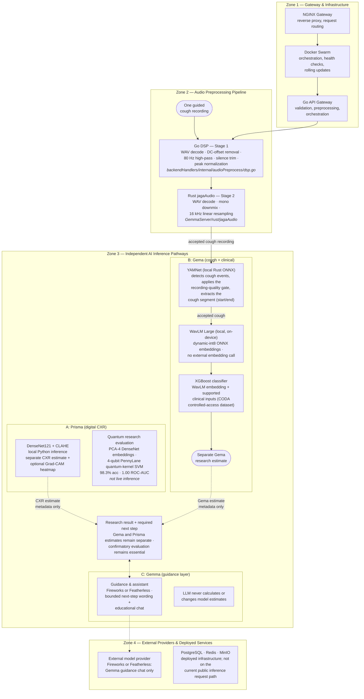

# Jaga — Backend Architecture

Four zones, two independent AI pathways that are **never fused**. Solid arrows are the live internal request flow; dashed arrows are external API calls or evaluation metadata.

Notes:

- **Privacy:** public demo inputs are processed transiently and are not retained.
- **Efficiency:** the YAMNet gate passes only the detected cough segment to WavLM, and WavLM runs fully as a local int8 ONNX model in Rust — no external embedding call. Fireworks/Featherless is used only for the Gemma guidance chat.
- **Safety:** the LLM writes guidance copy around the model output; probabilities always come from the classical models. Every LLM failure path falls back to deterministic bilingual copy.
- **Training:** both models were trained on AMD Instinct MI300X (AMD Developer Cloud, ROCm PyTorch) — see the README's "AMD & approved compute usage" section.
